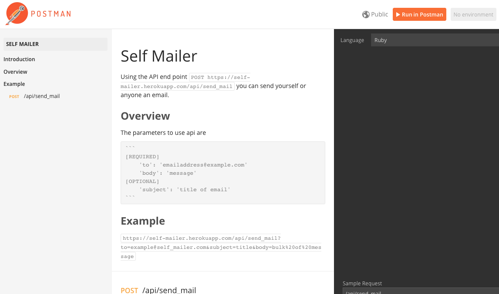
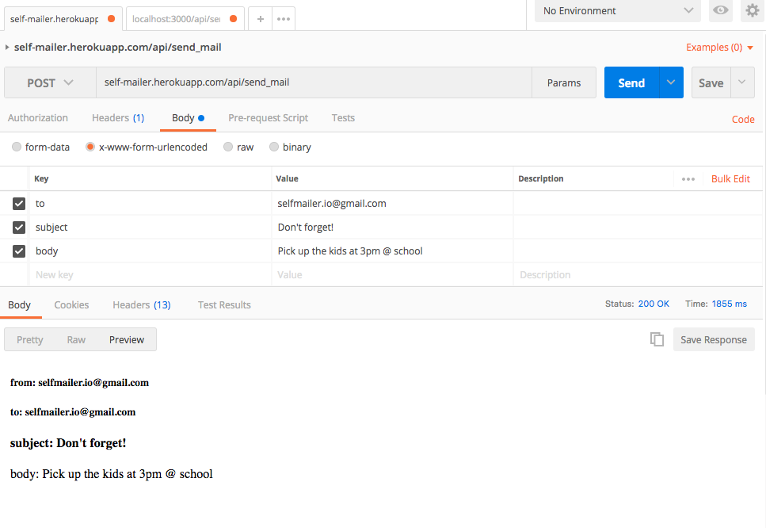
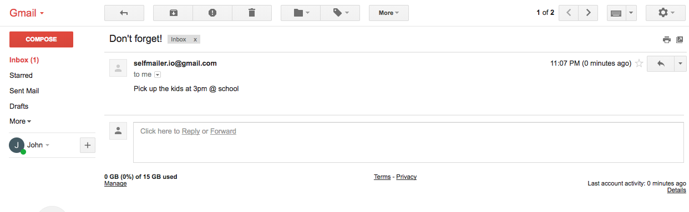

# [Self Mailer API]('https://self-mailer.herokuapp.com/')


## Overview
[Self Mailer]('https://self-mailer.herokuapp.com/') is a Rails API application that allows users to send an email to themselves using a single endpoint.

## Technologies Used
    - Backend
        - Ruby
        - Rails
        - ActionMailer
        - Gmail SMTP
    - Frontend
        - HTML/CSS/JavaScript
        - SASS
    - Documentation
        - Postman

## End Point
Mailer API's end point
```
    method: POST
    url:    https://self-mailer.herokuapp.com/api/send_mail
```
## Expected Payload
```
data: {
    'to': 'example@email.com',
    'subject': 'Title',
    'body': 'message'
}
```
## [Documentation]('https://documenter.getpostman.com/view/1627816/self-mailer/7LrcfqJ')



## Example



